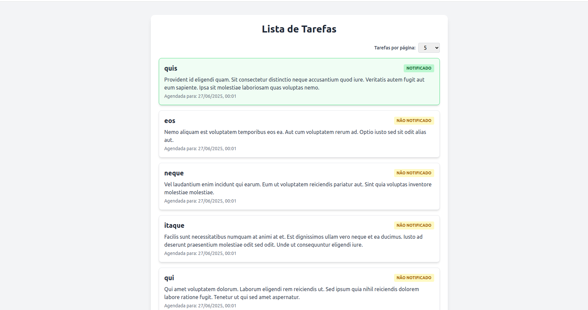

# Projeto Tasks API + Vue.js

## Requisitos

- Docker e Docker Compose instalados
- Node.js (v16+ recomendado)
- npm ou yarn
- Navegador moderno


## Baixando o projeto

```
git clone https://github.com/Luizfelipess/tasks.git tasks
```

## Como rodar o projeto

### Backend (Laravel)

- Abra um terminal e entre na pasta do backend (ex: `tasks/backend`)
- Execute o comando para subir o container Docker:

    ```
   docker-compose up -d
    ```
- Rode o comando para instalar as dependências do Laravel:

```
composer install
```
- Copie o arquivo de variáveis de ambiente:

```
cp .env.example .env
```
- Edite o arquivo .env para configurar o banco de dados:

```
DB_CONNECTION=mysql
DB_HOST=mysql_1
DB_DATABASE=laravel
DB_USERNAME=laravel
DB_PASSWORD=secret
```

- Entre no container:

```
docker exec -it tasks bash
```
- Gere a chave de aplicação do Laravel:

```
php artisan key:generate
```

- Dentro do container, rode as migrations e seeders:

```
php artisan migrate --seed
```

- Ainda dentro do container, rode o comando customizado para checar tasks:

```
php artisan check:tasks
```

- Ainda dentro do container, rode o comando para rodar a fila:

```
php artisan queue:work
```

- Em outro terminal, veja os logs da fila para acompanhar jobs:

```
docker logs -f tasks
```

### API RESTful

Foi implementada uma API RESTful no backend Laravel com o seguinte endpoint principal:

- GET /api/v1/tasks

  - Retorna uma lista paginada de tarefas

  - Parâmetros opcionais:

    - page: número da página (padrão: 1)

    - per_page: número de itens por página (padrão: 20).

Exemplo de chamada:

```
GET http://localhost:8000/api/v1/tasks?page=1&per_page=5
```


### Frontend (Vue.js)

Entre na pasta do frontend (ex: tasks/frontend)

Instale as dependências:

```
npm install
```

Rode a aplicação:

```
npm run dev
``` 

Abra **http://localhost:3000** no navegador para acessar.

A interface gráfica consome a API backend para listar tarefas. Ao iniciar o frontend, você verá uma lista paginada. Tarefas notificadas são destacadas visualmente.

O frontend exibe mensagens visuais de carregamento, erro e ausência de dados, permitindo uma melhor experiência ao interagir com a API. Para avaliação completa da aplicação, recomenda-se mantê-lo em execução durante a análise.

### Imagem do projeto




### O que foi implementado

- Backend em Laravel 12.19.3 seguindo Clean Architecture

- API RESTful com paginação de tarefas e endpoint para verificar notificações pendentes

- Job para processar notificações de tarefas

- Frontend desacoplado em Vue 3 com Tailwind CSS

- Listagem paginada de tarefas, filtro por quantidade por página

- Componentes para exibição individual das tasks, spinner de carregamento e paginação

- Feedback visual para tarefas notificadas


## Features futuras sugeridas

- Implementar filtros avançados (data, status)

- CRUD completo para tarefas (adição, edição e exclusão)

- Notificações via WebSocket para atualização em tempo real

- Testes automatizados e cobertura de código
